# ALTAIR Hypermesh Minimal Working Example

> Some simple sample Cp field and associated `NASTRAN` `PLOAD4` are uploaded here to ease the Toolkit *prise en main*

## Flowchart

-1. Open `Hypermesh` Desktop

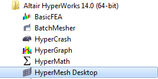

Let :

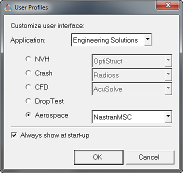

-2. Import a `NASTRAN` Solver Deck

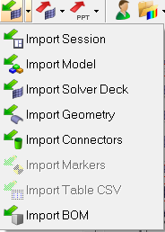

here

```bash
SOL101_simple-plate_unloaded_mwe.dat
```
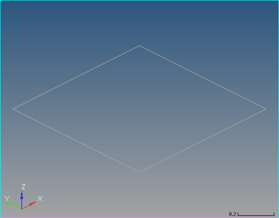

-3. Run Simple `.tbc` (find *ad hoc* function in Aeropace Menu)

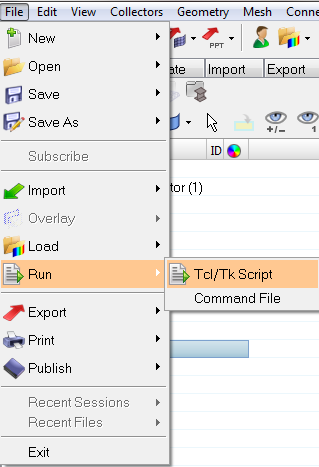

A pop-up window appears :tada::

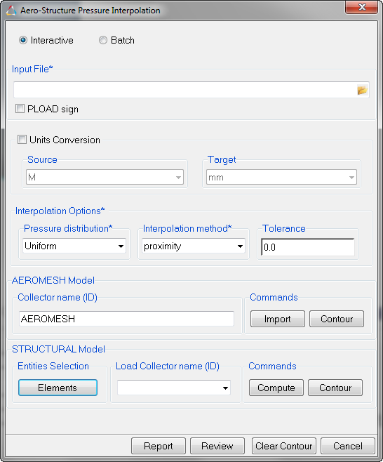

-4. Cp Input
  - Select whatever `.air` (4 columns), `.avt` (11 columns) or `.csv` (automatic detection of file columns number) Cp input
  - Select units
  - Select element normal convention

Here

```bash
~/simple-plate/air/9001000.air
```
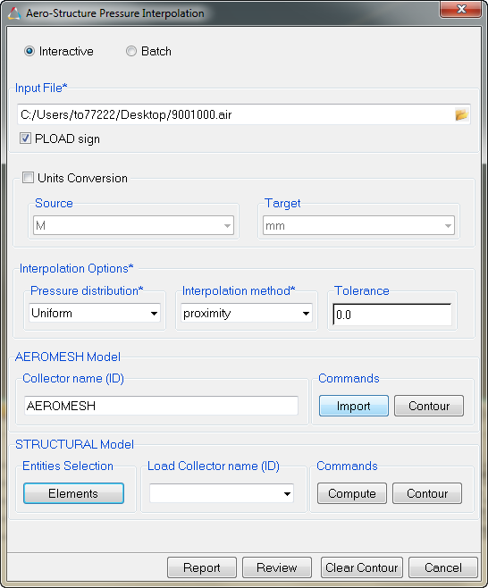

The points of the `Cp` field are shown in blue herebelow with in grey the initial `NASTRAN` mesh :

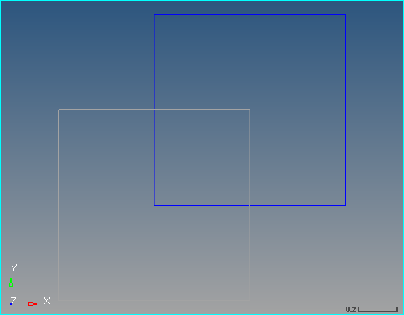

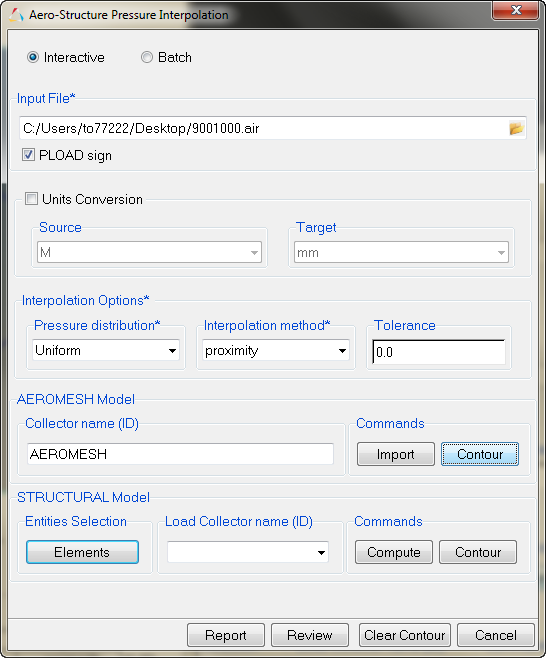

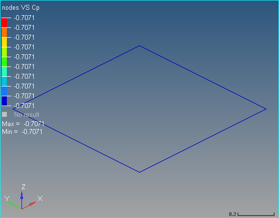

-5. Select the elements from Step 2. `NASTRAN` Mesh to receive the interpolated pressures
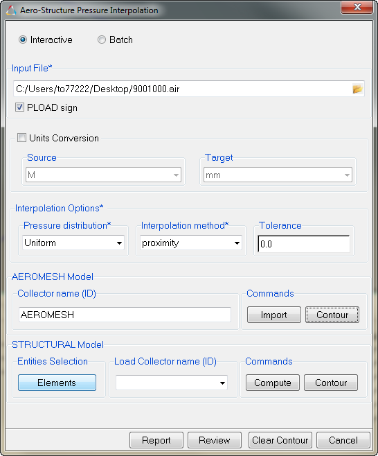

Set a `PLOAD4` id. between parenthesis *e.g.* 9001000 (9001094) and `Compute`

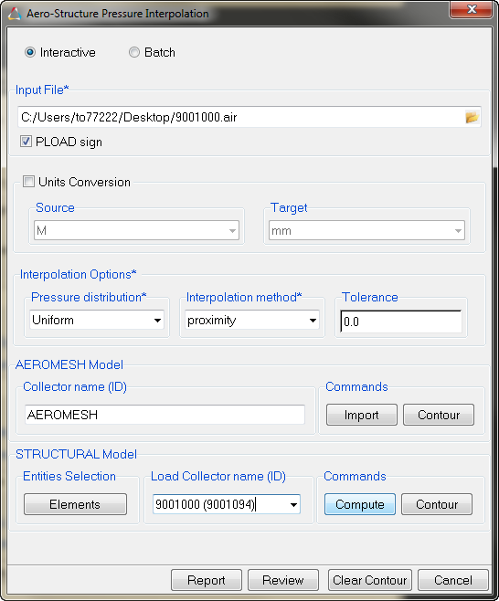

`Cp` field is map :tada: :

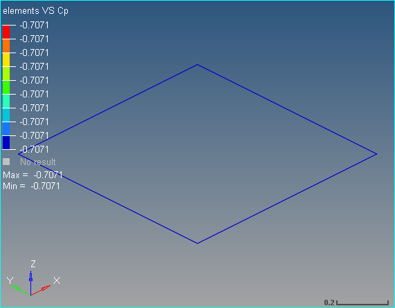

-6. Cross check under `Hyperview` the input field and the output field are good looking with `Review`

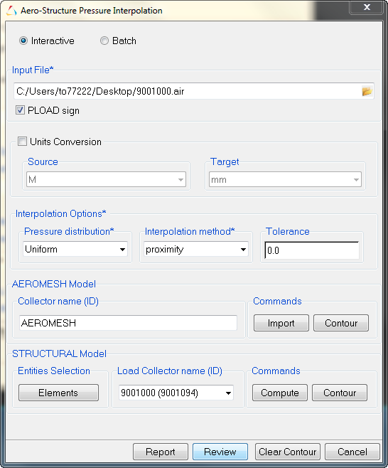

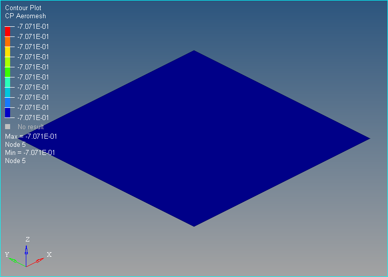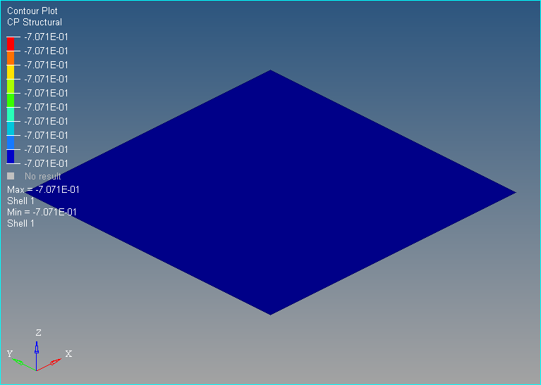

-7. `Export` Solver Deck in order to have the `NASTRAN` `PLOAD4`

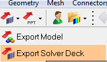

-8. Realize a `NASTRAN` `SOL 101` cold run in order to cross check the `OLOAD` of the loading vs. the `Cp` reference. `LOAD` Card is to be added properly.

-9. Swith radio button to `Batch`  to Run Batch `.tbc` if many loadcases are desired : only difference is the `SET` of elements to receive `Cp`  interpolation is to be defined as an `Hypermesh` `SET` ; then Input Table is self explanatory vs. Simple `.tbc`

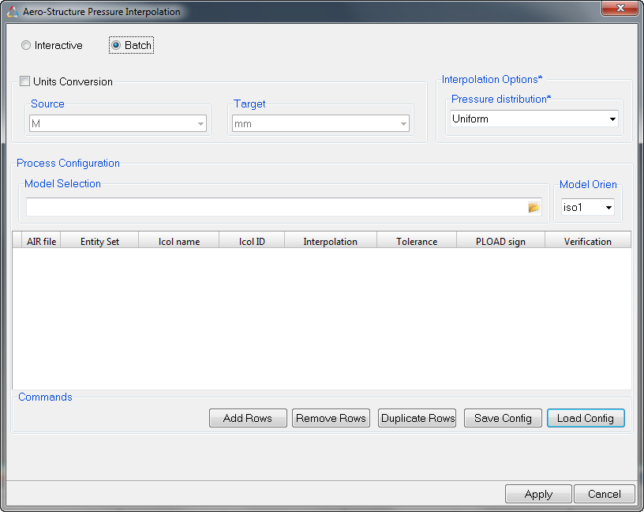

-10. That's all folks :rocket:
